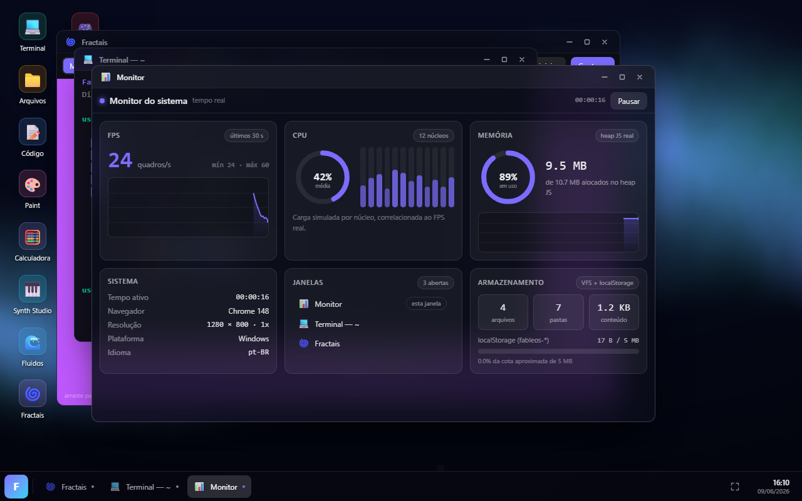
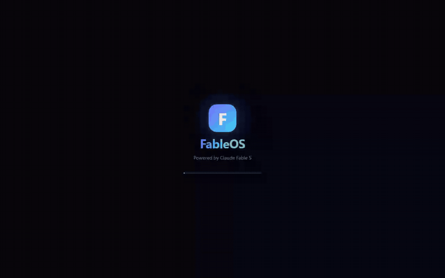
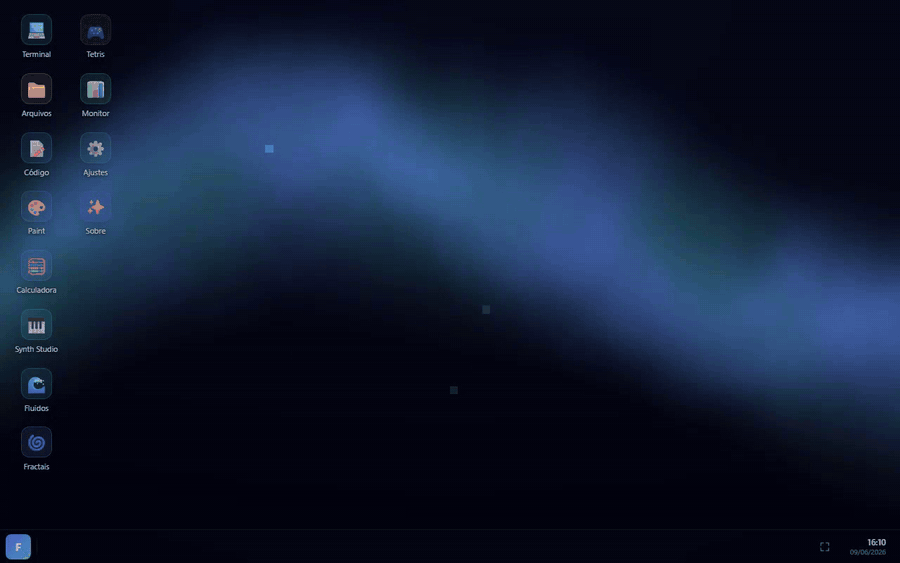
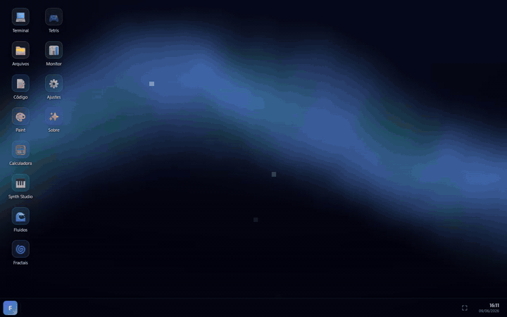
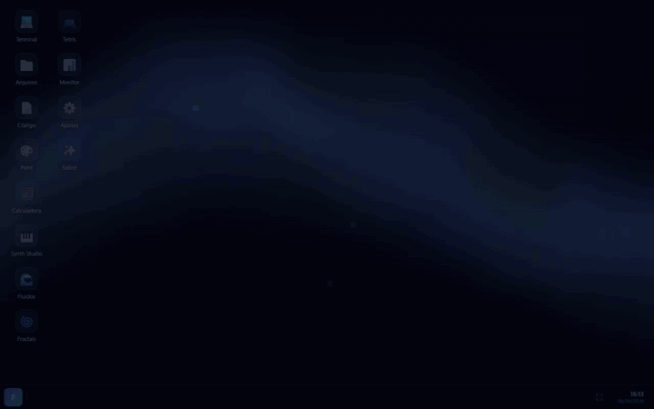
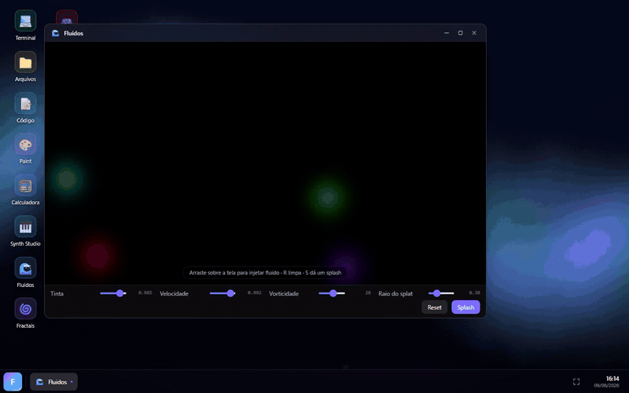
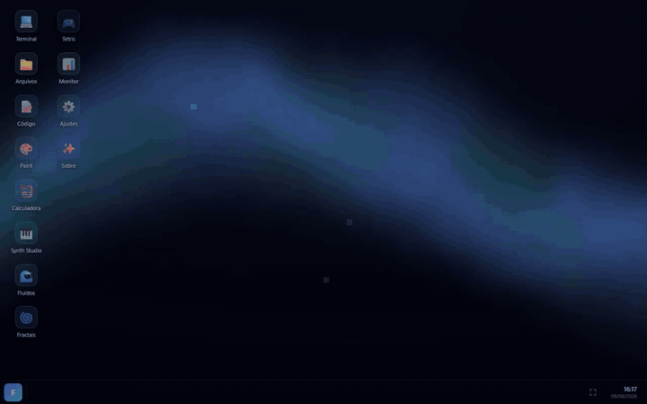
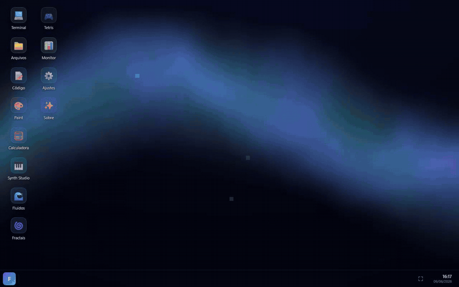
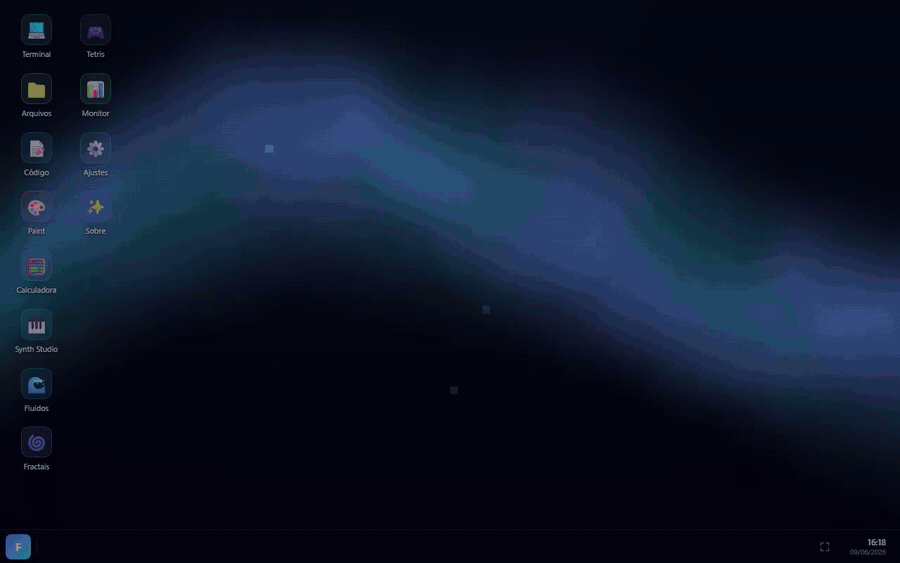

<div align="center">



# FableOS

**Um sistema operacional completo rodando no seu navegador.**

Window manager próprio · Sistema de arquivos virtual · 12 aplicativos nativos · WebGL · Web Audio

[](https://react.dev)
[](https://www.typescriptlang.org)
[](https://vite.dev)
[](https://tailwindcss.com)
[](#)

[Como rodar](#rodando-localmente) · [Aplicativos](#os-12-aplicativos) · [Arquitetura](#arquitetura) · [Documentação](#documenta%C3%A7%C3%A3o)

</div>

---

## O que é

O FableOS é um desktop completo que roda 100% no navegador, sem backend: janelas que você arrasta, redimensiona em 8 direções, maximiza e minimiza; um sistema de arquivos virtual persistente; terminal com shell próprio; taskbar, start menu com busca, menu de contexto e wallpapers animados **renderizados ao vivo em shaders WebGL**.

Tudo construído do zero com React 19, TypeScript estrito e Tailwind — **zero bibliotecas de UI, de áudio ou de gráficos**. Cada simulação física, sintetizador, parser e jogo é implementado na mão.



> Projetado e construído integralmente pelo **Claude Fable 5**: núcleo escrito à mão, 12 aplicativos desenvolvidos por 12 agentes de IA em paralelo, seguidos de revisão adversarial multi-agente. O contrato que os agentes seguiram está em [`AGENT-GUIDE.md`](AGENT-GUIDE.md).

## Rodando localmente

```bash
git clone https://github.com/leonardorejani/FableOS.git
cd FableOS
npm install
npm run dev     # http://localhost:5180
```

Build de produção: `npm run build` (sai em `dist/`, hospedável em qualquer estático).

Seus arquivos, tema e recordes persistem no `localStorage` do navegador.

## Os 12 aplicativos

### 💻 Terminal

Shell próprio (`fsh`) com 22 comandos sobre o sistema de arquivos real: `ls`, `cd`, `cat`, `echo` com redirecionamento (`>` e `>>`), `mkdir`, `rm -r`, `mv`, `cp`, tab-completion contextual, histórico com setas e `neofetch` com arte ASCII. Também controla o sistema: `open <app>`, `wallpaper`, `theme`, `reboot`.



### 📁 Arquivos

Explorador do VFS com sidebar de atalhos, breadcrumb clicável, histórico de navegação, criação/renomeio/exclusão inline e atalhos de teclado (Delete, F2, Enter, Backspace). Duplo clique em um arquivo abre direto no editor.


### 📝 Código

Editor com syntax highlight próprio para JS/TS, JSON, Markdown, CSS e HTML — implementado com a técnica de `<pre>` espelhado atrás de um `<textarea>` transparente com scroll sincronizado. Números de linha, Ctrl+S salva no VFS, indicador de modificado no título da janela.



### 🎨 Paint

Sete ferramentas (pincel suavizado, borracha, linha, retângulo, elipse, balde com flood fill scanline iterativo, conta-gotas), preview ao vivo de formas em canvas overlay, undo/redo com 30 snapshots, paleta + cor customizada, e exportação como PNG ou direto para o VFS.


### 🧮 Calculadora

Calculadora científica com **parser recursivo descendente próprio** (zero `eval`): precedência correta (`-2^2 = -4`), potência associativa à direita, funções trigonométricas com modo DEG/RAD, constantes, variável `ans` e histórico clicável.



### 🎹 Synth Studio

Sintetizador polifônico de 16 vozes (2 osciladores com detune, ADSR, filtro lowpass, delay com feedback) + sequenciador de 16 passos com bateria **100% sintetizada** (kick, snare e hi-hat gerados por osciladores e ruído, sem samples) e agendamento com lookahead. Tocável pelo mouse ou teclado físico.

Também disponível como projeto standalone: [leonardorejani/Synth-Studio](https://github.com/leonardorejani/Synth-Studio).


### 🌊 Fluidos

Simulação de fluidos Navier-Stokes ("stable fluids" de Jos Stam) resolvida inteiramente na GPU via WebGL2: advecção, vorticity confinement, 20 iterações de Jacobi para pressão e subtração de gradiente, com ping-pong de framebuffers half-float. Arraste o mouse e veja a tinta dançar a 60fps.



### 🌀 Fractais

Explorador de Mandelbrot e Julia renderizado em fragment shader com escape-time suave (sem bandas) e paletas de cosseno. Zoom centrado no cursor com a roda do mouse, modo "Julia segue o mouse" e captura de PNG.


### 🎮 Tetris

Implementação completa: randomizer 7-bag, rotação SRS com wall kicks, ghost piece, hold, fila de 3 próximas peças, lock delay com reset limitado, DAS, animação de line clear e recorde persistente.



### 📊 Monitor

Dashboard de desempenho em tempo real: FPS medido de verdade via `requestAnimationFrame`, heap JS, gráficos de linha desenhados à mão em canvas, gauges SVG, janelas abertas e uso do armazenamento.



### ⚙️ Ajustes

Cor de destaque e wallpaper aplicados **ao vivo no sistema inteiro** — janelas, taskbar, apps e shaders reagem na hora. Inclui informações do sistema e reset de fábrica.



### ✨ Sobre

O tour do sistema: grid com todos os apps (clique para abrir), destaques técnicos e atalhos.


## Arquitetura

```
src/
├── system/              # o "kernel"
│   ├── windowStore.ts   #   window manager (zustand): z-order, bounds, foco
│   ├── vfs.ts           #   sistema de arquivos virtual → localStorage
│   ├── themeStore.ts    #   accent + wallpaper persistentes
│   ├── apps.ts          #   metadados dos 12 apps
│   └── registry.tsx     #   code-splitting: 1 chunk lazy por app
├── components/          # desktop, janela, taskbar, start menu, wallpaper WebGL
└── apps/                # um diretório isolado por aplicativo
```

- **Zero backend** — tudo client-side; arquivos e preferências persistem em `localStorage`.
- **Zero dependências de UI** — só React, Zustand e Tailwind. Shaders, áudio, parsers e jogos são código próprio.
- **Code-splitting real** — cada app carrega sob demanda no primeiro uso (`React.lazy` + `Suspense` por janela).
- Apps são isolados e se comunicam com o sistema por um contrato mínimo (`AppProps`, VFS, stores).

Mergulho completo em [docs/ARQUITETURA.md](docs/ARQUITETURA.md).

## Documentação

| Documento | Conteúdo |
|---|---|
| [docs/ARQUITETURA.md](docs/ARQUITETURA.md) | Núcleo: window manager, VFS, temas, shaders do wallpaper, boot |
| [docs/APPS.md](docs/APPS.md) | Os 12 aplicativos em detalhe: funcionalidades, atalhos e engenharia interna |
| [docs/DESENVOLVIMENTO.md](docs/DESENVOLVIMENTO.md) | Como rodar, estrutura, tutorial "criando um novo app" e APIs do sistema |
| [AGENT-GUIDE.md](AGENT-GUIDE.md) | O contrato que os 12 agentes de IA seguiram durante a construção |

## Atalhos do sistema

| Ação | Como |
|---|---|
| Maximizar / restaurar janela | Duplo clique na barra de título |
| Redimensionar | Arrastar bordas ou cantos (8 direções) |
| Menu de contexto | Clique direito no desktop |
| Abrir app | Duplo clique no ícone ou start menu (busca + Enter) |
| Minimizar / restaurar | Clique no app na taskbar |

---

<div align="center">

**FableOS 1.0.0** — projetado e construído pelo Claude Fable 5 · 2026

</div>
